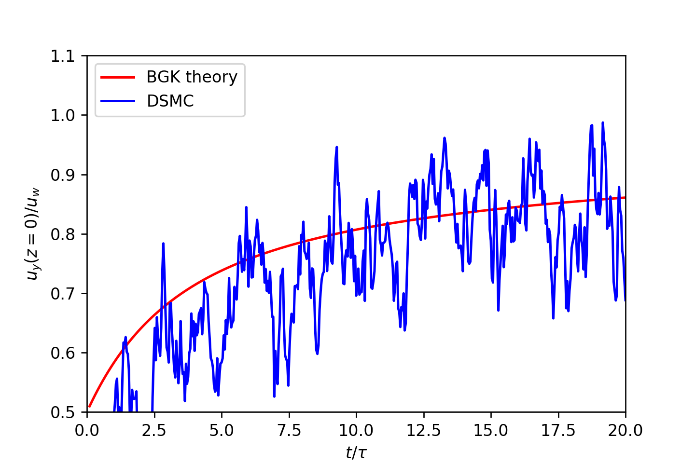

# dsmc-python
Direct Simulation Monte Carlo of the Rayleigh problem

## Create Your Own Direct Simulation Monte Carlo (With Python)

### Philip Mocz (2021) Princeton Univeristy, [@PMocz](https://twitter.com/PMocz)

### [📝 Read the Algorithm Write-up on Medium](https://medium.com/swlh/create-your-own-direct-simulation-monte-carlo-with-python-3b9f26fa05ab)

Simulate dilute gas with DSMC: the Rayleigh problem


```
python dsmc.py
```


